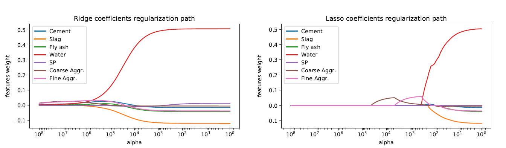

# CSE-574-Machine_Learning
##
## Project 1- Modeling Slump Flow of concrete

**Task 1:** Compare Unregularized (Linear) and Regularized (Rideg, Lasso) regression on Slump Flow of concrete using Cross Validation.

[SlumpFlowValidation.py](Project1-Modeling_Slump_Flow/code/SlumFlowCrossValidation.py)

**Task 2:** Generate graph for Reguarization path - co-oefficient vs weight of sample data on Slump Flow

[RegularizationPathGraph.py](Project1-Modeling_Slump_Flow/code/RegularizationPathGraph.py)

Output:

