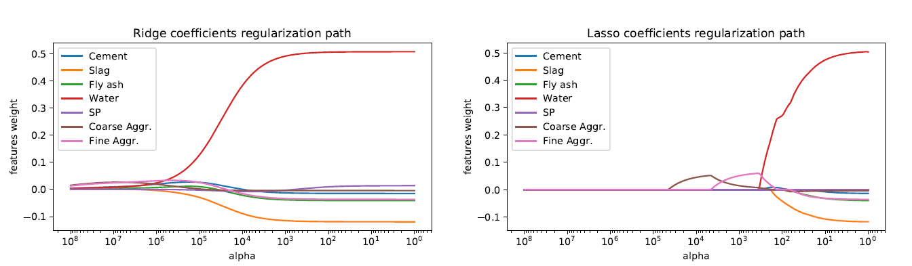

# CSE-574-Machine_Learning

## Project 1- Modeliing Slump Flow of concrete

Task 1: Compare Unregularized (Linear) and Regularized (Rideg, Lasso) regression on Slump Flow of concrete using Cross Validation.
Task 2: Generate graph for Reguarization path vs weight of sample data on Slump Flow

Output:

